# 《清明上河图》三维交互长卷

**qingming-scroll-3d** — 用 Blender 程序化建模 + Three.js 实时渲染,在浏览器里重建
汴河、编木虹桥与两岸市井。

**在线打开:** https://hyp13048196060.github.io/qingming-scroll-3d/
(由本仓库的 GitHub Actions 构建并部署,每次推送自动更新)

<p align="center">
  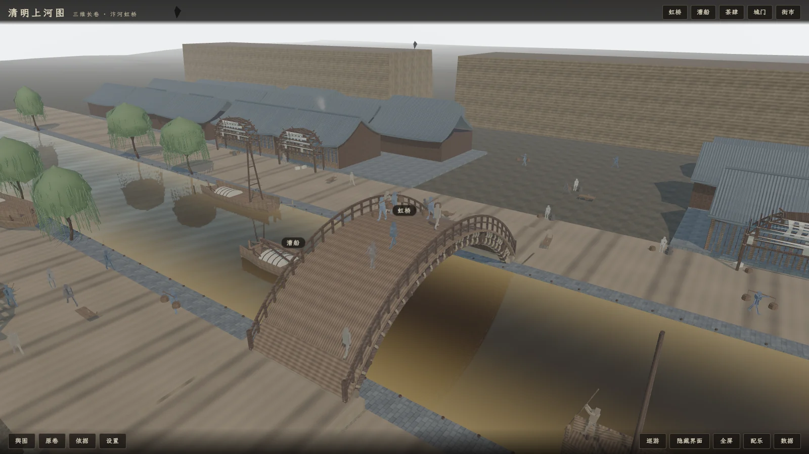
</p>

---

## ⚠️ 先说清楚这是什么

**这是一次「用一个提示词让 AI 自主做完一个三维作品」的实际使用体验测试。**

仓库的主人给了一份分阶段的提示词(全文见
[`docs/11-提示词与工作流.md`](docs/11-提示词与工作流.md)),然后不再干预,
由 AI 逐阶段执行:建模 → 导出 → 上线 → 截图自查 → 改 → 再自查。
这个仓库就是那次测试的**全部产物**,包括它的失败记录。

所以读这个仓库时请注意:

- **它不是考古复原成果。** 全部几何由程序化脚本生成,尺寸链的根节点是一个
  估读值。详见 [`docs/01-复原依据与考据.md`](docs/01-复原依据与考据.md)
  与 [`docs/08-已知局限与未做还原.md`](docs/08-已知局限与未做还原.md)。
- **它不是「稳定 60fps」的演示。** 真实的帧开销读数在
  [性能](#性能真实读数)一节,连同它的抖动幅度一起给出。
- **它把「造这把尺子」和「量出来的数」分开记。** 项目里有一份
  [仪器错误台账](#一份额外的产出仪器错误台账),记录了 54 次「量具本身出错、
  得出一个漂亮但方向相反的结论」的事故。这是这个仓库里最特别的部分。

---

## 目录

- [它长什么样](#它长什么样)
- [快速开始](#快速开始)
- [可运行的功能](#可运行的功能)
- [操作方式](#操作方式)
- [性能:真实读数](#性能真实读数)
- [客观不足](#客观不足)
- [文档索引](#文档索引)
- [项目结构](#项目结构)
- [第三方素材与许可](#第三方素材与许可)
- [一份额外的产出:仪器错误台账](#一份额外的产出仪器错误台账)
- [许可](#许可)

---

## 它长什么样

全部截图由 [`tools/capture_showcase.mjs`](tools/capture_showcase.mjs) 在无头 Chrome 里
自动拍摄,**每一张都记录了拍摄当时的真实状态与实测读数**
(`applied` 字段,不是 URL 里写了什么)。网页版见
[`screenshots/showcase/`](screenshots/showcase/)。

### 五个景点

| | | |
|---|---|---|
|  | 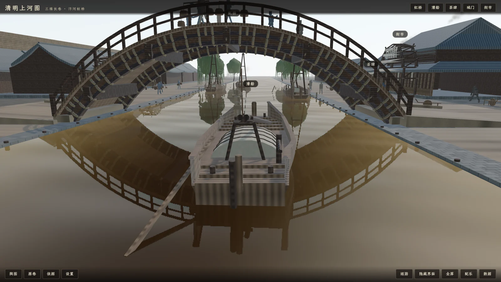 | 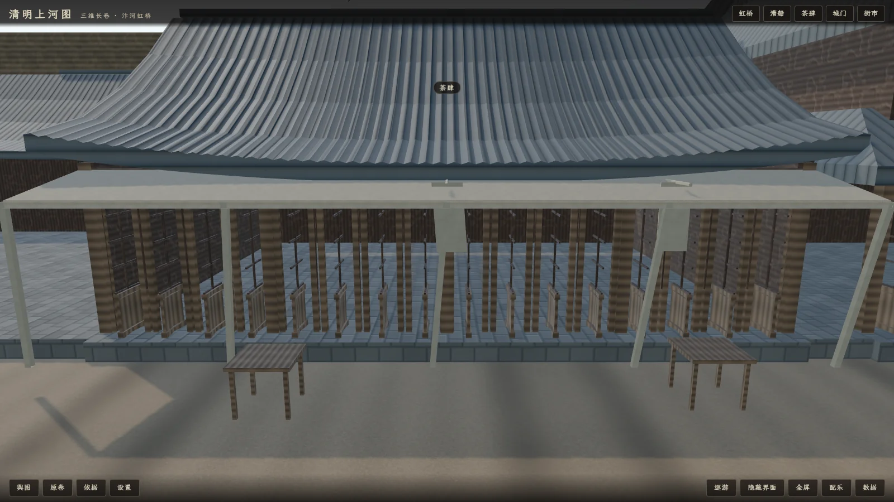 |
| **虹桥** 桥面行人、桥下漕船 | **漕船** 船体、桅杆、篷索与倒影 | **茶肆** 沿河商铺立面与幌子 |
| 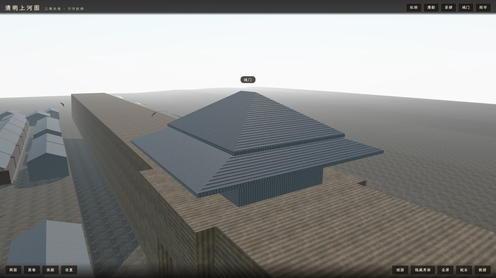 | 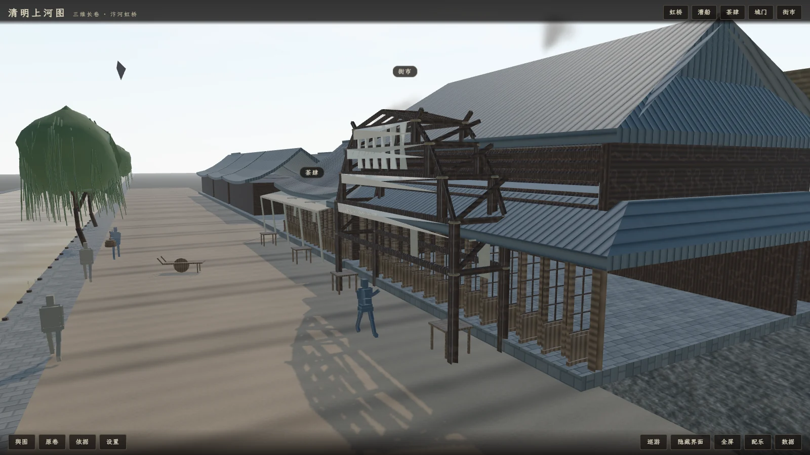 | |
| **城门** 城楼、门洞与进出人流 | **街市** 街巷两侧屋舍与摊位 | |

> 原提示词里这五个按钮叫「虹桥胜景 / 汴河漕运 / 沿岸市井 / 街巷营造 / 城阙远眺」,
> 实现时改成了更短的直白名字。**以代码为准**(`src/data/spots.json`)。
> 这是实现与原要求在措辞上的偏离,记在这里以免读者对照提示词时找不到按钮。

### 三个时辰

| | | |
|---|---|---|
| 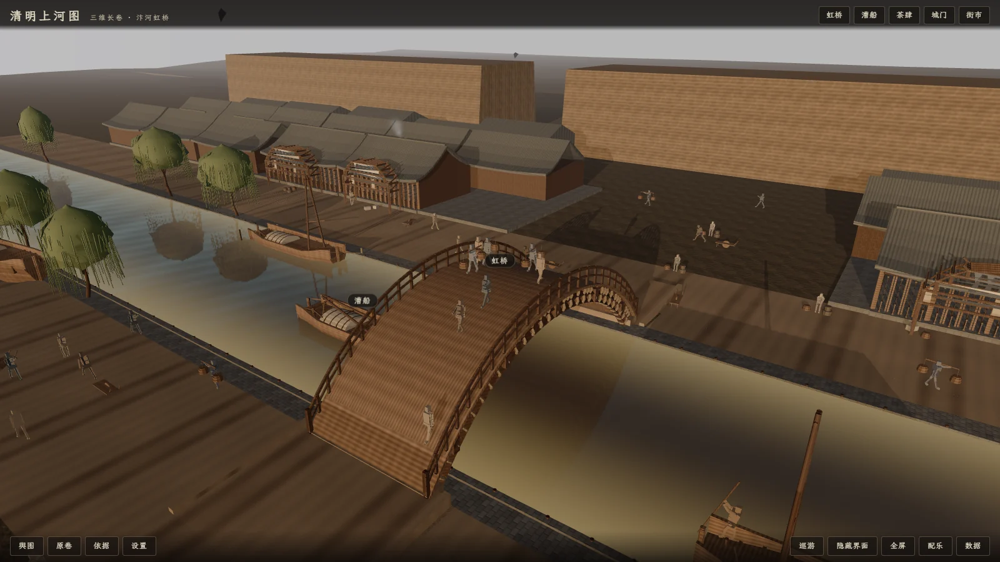 |  | 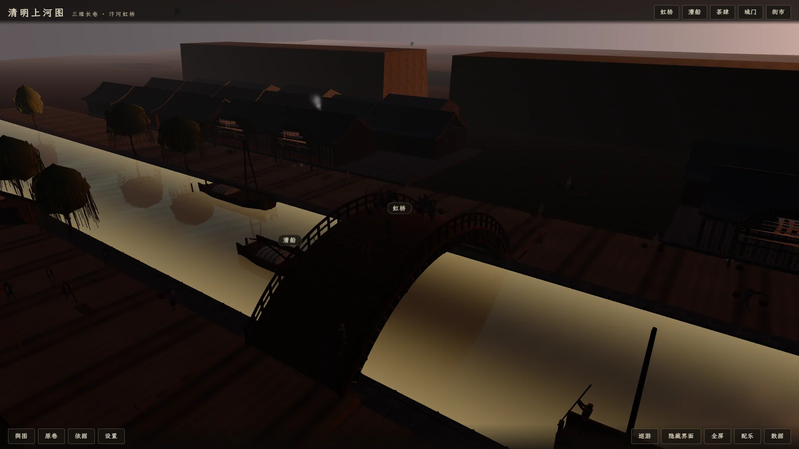 |
| **清晨**(太阳仰角 52°) | **白昼**(太阳最高) | **暮色最深**(太阳仰角 3°) |

最暗的一档仍是黄昏,**不是夜晚** —— 没有月光与灯烛。

### 三档画质

| | | |
|---|---|---|
| 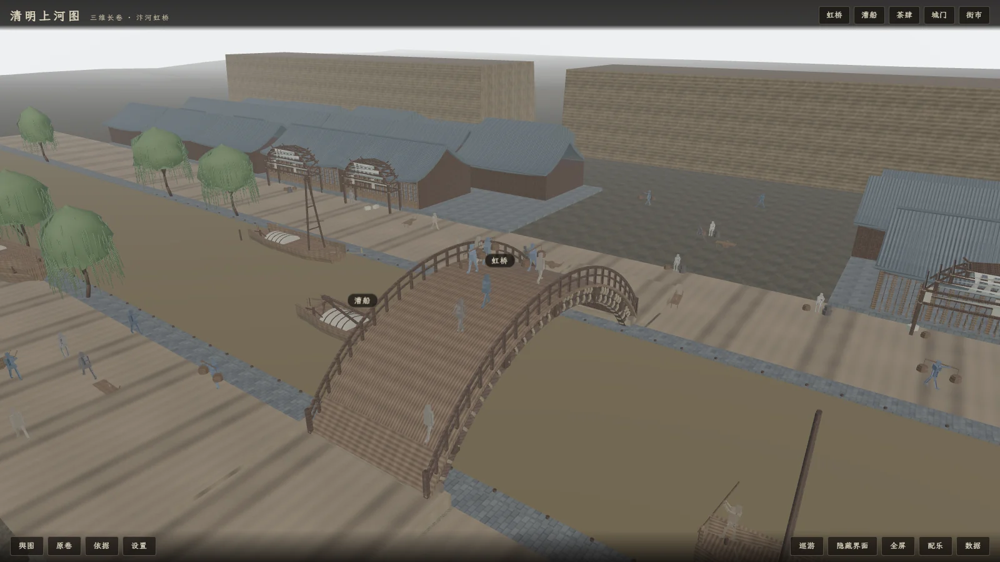 | 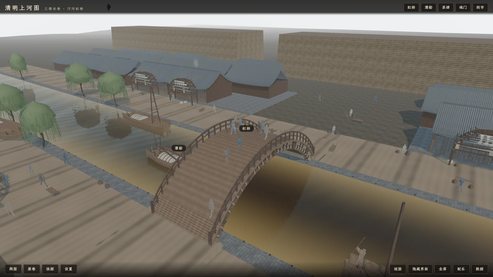 | 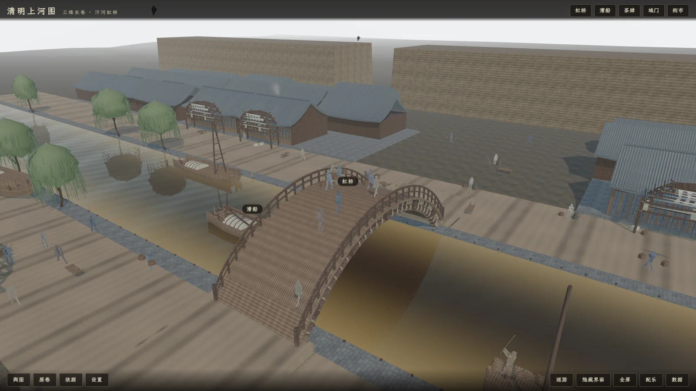 |
| **low** 关阴影/关反射、LOD 降级 | **mid** 开阴影、反射降频 | **high** 全量阴影 + 实时水面反射 |

### 界面面板与移动端

| | | | | |
|---|---|---|---|---|
| 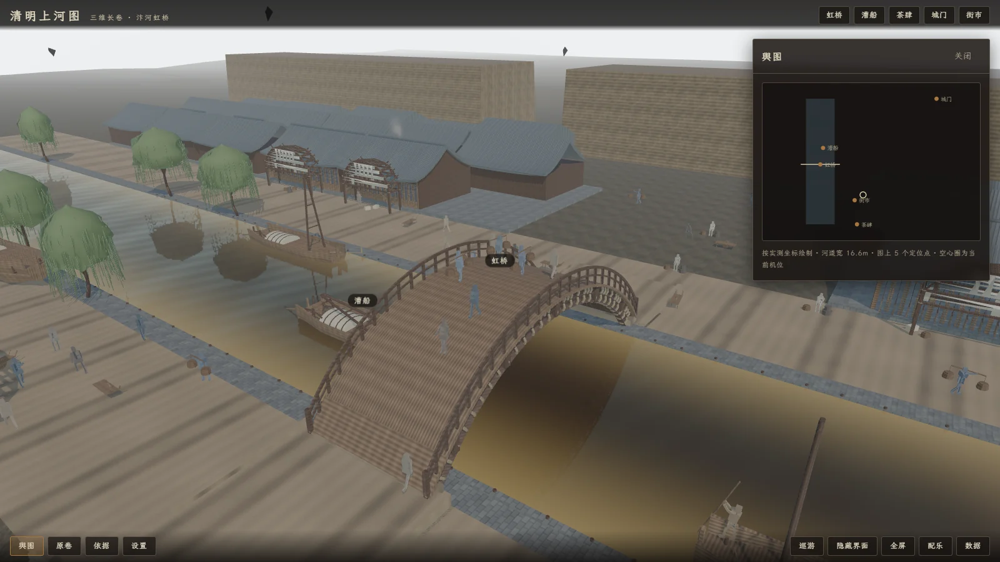 | 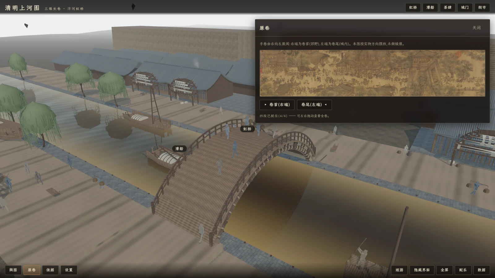 | 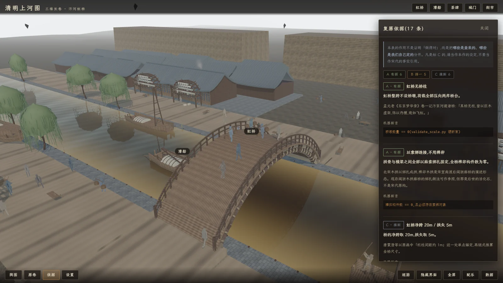 | 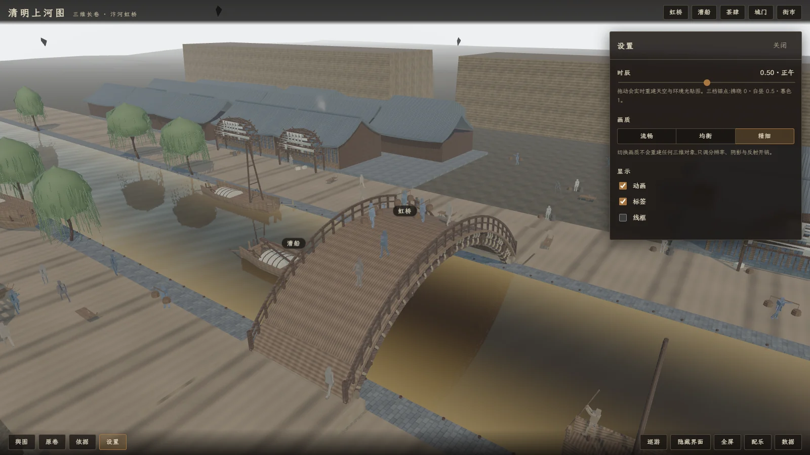 | 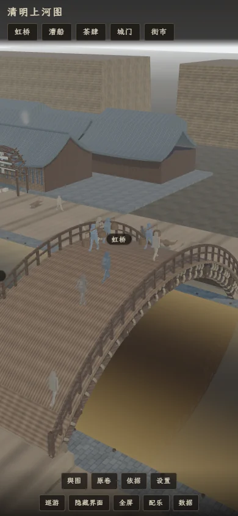 |
| **舆图** | **原卷** | **依据** | **设置** | **移动端** |

「依据」面板是把这个作品的**推定边界直接写在界面里**:每个构件的依据等级与
不确定度,用户点开就能看见,不需要去翻文档。

---

## 快速开始

### ⚠️ 先看 Node 版本要求

```jsonc
// package.json
"engines": { "node": ">=24.0.0 <25" }
```

配合 `.npmrc` 里的 `engine-strict=true`,**Node 版本不在 24.x 范围内时
`npm ci` 会直接拒绝安装**,不是警告。

这是有意为之(避免版本漂移导致构建行为不一致),但对第一次 clone 的人来说
是个硬门槛:**请先 `node -v` 确认是 24.x。**

### 跑起来

```bash
git clone <本仓库地址>
cd artist-coding2

npm ci          # 安装依赖(Node 必须是 24.x)
npm run build   # 构建到 dist/
npm run preview # 本地静态服务,默认 http://127.0.0.1:4173/
```

打开 `http://127.0.0.1:4173/` 即可。

开发模式(带热更新):

```bash
npm run dev
```

### 一个干净目录就能跑起来

模型、字体、贴图、解码器**都在运行资产里或由构建期自动补齐**,
不需要额外下载、不依赖任何外部 CDN:

| 资产 | 位置 | 来源 |
|---|---|---|
| 4 个 GLB 模型 | `public/models/` | 已入库 |
| 原画切片(4 段 3840×732) | `public/original/` | 已入库 |
| 界面字体(子集化 WOFF2) | `src/assets/fonts/` | 已入库 |
| Draco / Basis / Meshopt 解码器 | 构建时复制进 `dist/` | 由 `npm ci` 提供的 three.js |
| 字体许可全文 | `public/fonts/` | 已入库 |

解码器走的是构建期从 `node_modules/three/examples/jsm/libs/` 复制
(见 [`vite.config.ts`](vite.config.ts)),所以既满足「包含在运行资产中」,
又不必把 wasm 提交进 git。

### 其它命令

```bash
npm run typecheck   # TypeScript 类型检查
npm run shot        # 无头截图(带 GPU/空白/URL 参数三重校验)
npm run stats       # 资产统计
npm run repro       # 可复现性校验(跑两次比对)
```

---

## 可运行的功能

**这一节列的都是能点、有反应的控件。** 项目从一开始就遵守一条要求:
*使用真实按钮与状态,不做无响应的装饰控件。*

| 功能 | 状态 | 说明 |
|---|---|---|
| 自由视角 | ✅ | 左键环视、滚轮缩放、右键平移、键盘移动 |
| 五个景点跳转 | ✅ | 虹桥 / 漕船 / 茶肆 / 城门 / 街市,镜头平滑过渡 |
| 空间标签 | ✅ | 虹桥、漕船、茶肆,点击展开简介与「走近看看」 |
| 舆图 | ✅ | 全卷缩略图 + 当前机位标记 |
| 横向浏览原卷 | ✅ | 高清原作对照,可缩放平移到当前景点 |
| 复原依据面板 | ✅ | 逐构件的依据等级与不确定度 |
| 三个时辰 | ✅ | 清晨 / 暖日 / 暮色,太阳高度与光色连续变化 |
| 三档画质 | ✅ | low / mid / high,差异落在阴影、反射、粒子密度上 |
| 动画 / 标签 / 线框 / HUD 开关 | ✅ | 各自独立,可组合 |
| 自动巡游 | ✅ | 手动操作会退出巡游 |
| 隐藏界面 / 全屏 | ✅ | |
| 原创配乐 | ✅ | 程序化合成的拨弦音,**不是音频文件**(见下) |
| 真实加载进度 | ✅ | 非假进度条 |
| 资源失败 / 图形上下文中断提示 | ✅ | WebGL context lost 有明确提示 |
| 移动端布局 | ✅ | 工具栏折行、面板全宽;副标题在窄屏隐藏 |

### 关于配乐

没有随仓库分发任何音频文件。配乐是**运行时程序化合成**的:
一个手写的 Karplus-Strong 拨弦 `AudioWorklet`,在
`src/audio/worklets/pluck-processor.js`。所以它是原创的,
也没有第三方音乐授权问题。

---

## 操作方式

| 操作 | 效果 |
|---|---|
| 左键拖动 | 环视 |
| 滚轮 | 缩放 |
| 右键拖动 | 平移 |
| WASD / 方向键 | 移动观察位置 |
| 点击空间标签 | 展开简介 |
| 手动操作 | 自动退出巡游 |

---

## 性能:真实读数

**完整报告见 [`docs/05-性能测量报告.md`](docs/05-性能测量报告.md)。**
那份文件由脚本从实测 json 生成,**没有任何一个数字是手写的**。

测量环境:

| 项 | 值 |
|---|---|
| GPU | `ANGLE (NVIDIA, NVIDIA GeForce RTX 3060 Laptop GPU, Direct3D11)` |
| 浏览器 | Chrome/153.0.8010.37(无头) |
| 视口 | 1920×1080 @ dpr 1 |

测量协议:加载 → **热身 8000ms 丢弃** → `resetStats()` → 测量 8000ms → 读数。

### 门限对照

| 指标 | 目标 | 本机最坏值 | 判定 |
|---|---|---|---|
| **一帧 CPU 总量 p95** | 16.7 ms | **16.66 ms**(low/bridge) | ✓ |
| 只绘制 p95 | 20 ms | **7.78 ms**(high/bridge) | ✓ |
| 主 pass drawcall | 220 | **152** | ✓ |
| 总三角面 | 1,200,000 | **395,418** | ✓ |
| 阴影 pass 三角面 | 800,000 | **169,196** | ✓ |
| 反射 pass 三角面 | 500,000 | **106,184** | ✓ |
| shader program | 60 | **21** | ✓ |

### 这些数字该怎么读(重要)

**「一帧 CPU 总量」(`bothCost`)才是「够不够 60fps」的答案**,
它是逻辑 + 绘制的合计;「只绘制」只是它的一部分。
这份报告的第一版和第二版**都只量了一部分就下了结论,两次都是错的**——
第 3 节完整保留了那两次错误。

**本作品不声称「稳定 60fps」。** 上面 16.66ms 是**本机、无头、1080p**
下的读数,真机上帧时会被 vsync 钳到刷新率的整数倍,与「开销」不是同一个量。
最坏那一档相对 60fps 预算(16.7ms)的余量只有约 **1.0 倍**。

**任何一个具体数字都带抖动。** 同一天紧接着跑第二次完整采集,
high/bridge 的「只绘制 p95」两次之间差了 **70%**(4.57ms → 7.78ms)——
两次都判达标,但**表里的数字不该被横向比较**
(例如拿 low 的 3.73 和 high 的 7.78 去比「贵了 2.1 倍」,那个倍数落在抖动之内)。

> ⚠️ 截图清单 `screenshots/showcase/manifest.json` 里的 `avgFps` / `p95ms`
> **不是作品的开销**,是无头 Chrome 的 rAF 节拍(本机空页面地板实测 6.10ms)。
> 那份文件自己写了这条警告。**要看性能只看 `docs/05`。**

### 一个已修的真实性能缺陷

首版实测里,`CharacterPool.update` 给每个走动的角色**每帧**打一次
没有 BVH 的地面射线,单次 p50 = 0.595ms,场上 37 个走动的人 ⇒ **约 22ms/帧,
占一帧的 85%**。而同一文件里的注释**本来就写着**「每移动 0.3 米才采一次」——
那句话当时只卡在赋值高度那一行上,**射线照打**。

画面上完全看不出异常。是「把一帧拆成环节逐个计时」之后,
「人物」以 22.64ms 顶在最上面才查出来的。修复后该环节降到 0.69ms。

> 这个缺陷的形状值得记住:**注释描述的是意图,代码没有实现它。**
> 所以本项目的台账里有一条规矩 —— 注释里的理由也要量。

---

## 客观不足

完整台账见 [`docs/08-已知局限与未做还原.md`](docs/08-已知局限与未做还原.md)
与 [`docs/01-复原依据与考据.md`](docs/01-复原依据与考据.md)。这里只列最要紧的:

### 一、复原层面

1. **不是考古测绘成果。** 没有一处来源是三维扫描或实测测绘。
2. **尺寸链的根节点是一个估读值。** 整套虹桥尺寸本质是唐寰澄基于
   「栏柱间距约 1m」所作的链式推算,**非实测** —— 它的误差会**等比传到
   所有下游尺寸**。
3. **未做绢本的笔触、墨色层次、题跋印章、装裱形制。** 本项目做的是**空间**,
   不是画面临摹 —— 岸上每件物体的**位置**参考原画构图,**外观**是程序化生成的。
4. **已证伪的说法记录在案。** 百度百科称虹桥「跨度约 5.28 米」是错的 ——
   528.7cm 是**全卷长度**。这条写进代码注释,防止将来有人「查证」时捡回来。
5. **等级体系有三套互不相同的口径**(`basis.json` / `config.py` / `docs/08`),
   目前并列存在、未统一。另外 `config.py` 里的 `Reliability` 枚举
   **定义了但从未被引用**,39 处标注全是注释,无法被机器校验。

### 二、性能层面

6. **单机单次采样,抖动可达 70%。** 没有做重复采集取统计。
7. **只测了静态机位。** 相机运动、快速切画质、标签页来回切,这些都**未测**。
8. **阴影每帧跑两次。** three 的 `shadow.autoUpdate` 默认为 true,反射 pass
   内部那次 render 会**再跑一遍阴影贴图**。已实测、**未优化**(当前距上限尚远)。
9. **贴地采样是节流过的。** 每 0.15m 才重采一次脚的高度,桥上最坏误差
   0.086m —— 近景贴地看仍可能有几厘米的浮空或下陷。

### 三、工程与可访问性

10. **顶栏对比度曾不达 WCAG AA,已修复。**
    实测标题 3.70:1、副标题 1.96:1(AA 门槛 4.5:1),副标题差了不止一倍。
    修复方式是**压暗遮罩**而不是调亮文字(浅色字压亮背景,靠改字色到不了 4.5:1)。
    修复后 8.22:1 / 6.02:1。**现已由
    [`tools/check_contrast.py`](tools/check_contrast.py) 在采集流程里强制把关。**
    这条之所以值得写出来,是因为它**肉眼看不出来** —— 暮色图里很清楚,
    换到白天那张就糊了,而人眼先看见的是能看清的那张。
11. **副标题在窄屏被隐藏**,属于有意的响应式取舍,但也意味着移动端信息更少。
12. **`screenshots/` 里约 300MB 的迭代截图留在本地**,未入库
    (判据与重建方式见 [`docs/07-录制剪辑.md`](docs/07-录制剪辑.md))。

### 四、哪些东西不在仓库里,以及各自怎么重建

上面第 12 条只是一例。**完整清单**(`node_modules/`、`dist/`、字体源文件
`.fontbuild/`、Blender 中间产物、录屏素材、软件安装包等)连同各自的获得方式,
列在 [`THIRD_PARTY.md`](THIRD_PARTY.md) 第 5 节。

这里只强调一条容易误解的:**运行期需要的东西全都在仓库里** ——
模型、字体子集、原画卷切片、以及构建时从 `node_modules` 现取的解码器,
`git clone` + `npm ci` + `npm run build` 之后都能就位,不依赖你本机装了什么。
不在仓库里的那些,是**中间产物和证据素材**,删掉不影响作品运行,只影响重新生成。

---

## 文档索引

| 文档 | 内容 |
|---|---|
| [`01-复原依据与考据.md`](docs/01-复原依据与考据.md) | 原画能确定什么、不能确定什么,依据等级 |
| [`02-实现原理.md`](docs/02-实现原理.md) | 装配顺序、主循环与帧统计、画质三档、水面反射、人物、状态与 URL |
| [`03-模型重建.md`](docs/03-模型重建.md) | Blender 程序化建模的构件台账 |
| [`04-离线部署说明.md`](docs/04-离线部署说明.md) | 构建、部署、无外部依赖的资产链 |
| [`05-性能测量报告.md`](docs/05-性能测量报告.md) | **性能数字的唯一出处**,含两次错误结论的存档 |
| [`06-音乐重建.md`](docs/06-音乐重建.md) | 程序化配乐的合成方式 |
| [`07-录制剪辑.md`](docs/07-录制剪辑.md) | 截图与本地留存的生成方式与重建(**仓库里没有录屏**,该文第 7 节记的是这个「没有」) |
| [`08-已知局限与未做还原.md`](docs/08-已知局限与未做还原.md) | **客观不足的完整台账** |
| [`09-资产统计.md`](docs/09-资产统计.md) | 资产规模统计 |
| [`10-阶段验收记录.md`](docs/10-阶段验收记录.md) | 每阶段的验收与遗留问题 |
| [`11-提示词与工作流.md`](docs/11-提示词与工作流.md) | 驱动本项目的提示词全文与执行记录 |

另有两份不属于 docs/ 的说明:
[`THIRD_PARTY.md`](THIRD_PARTY.md)(第三方素材与许可)、
[`public/original/CREDITS.md`](public/original/CREDITS.md)(原画扫描件考据)。

---

## 项目结构

```
.
├── blender/            程序化建模(Blender Python)
│   ├── build/            分步建模脚本
│   ├── lib/              公共库(tag_utils 等)
│   ├── tasks/            校验与探针
│   └── config.py         尺寸链与依据等级的**唯一声明处**
├── src/                Three.js 应用(TypeScript)
│   ├── core/             渲染循环、状态、URL 参数、pass 统计
│   ├── world/            地形、河流、天空与时辰
│   ├── actors/           人物、道具风动、粒子
│   ├── camera/           镜头调度与巡游
│   ├── audio/            程序化配乐
│   ├── ui/               界面与面板
│   ├── data/             spots / hotspots / basis / content
│   ├── styles/           样式
│   └── assets/fonts/     子集化字体
├── public/             运行资产(原样进入 dist)
│   ├── models/           GLB
│   ├── original/         原画切片与考据
│   └── fonts/            字体许可全文
├── tools/              测量与构建工具(含仪器错误台账里的那些探针)
├── scripts/            serve-dist.mjs(本地静态服务)
├── docs/               文档
├── tests/              测试
└── screenshots/        截图(showcase 为交付证据)
```

---

## 第三方素材与许可

**完整说明见 [`THIRD_PARTY.md`](THIRD_PARTY.md)。** 摘要:

| 素材 | 许可 |
|---|---|
| 本项目代码 | MIT(见 [`LICENSE`](LICENSE)) |
| three.js / @types/three | MIT |
| Vite / vite-plugin-static-copy | MIT |
| TypeScript | Apache-2.0(仅构建期) |
| Draco / Basis / Meshopt 解码器 | MIT(随 three.js) |
| **LXGW WenKai 霞鹜文楷**(子集化) | **SIL OFL 1.1**,带附加条件 ⚠️ |
| 《清明上河图》张择端本扫描件 | 公有领域 |

> ⚠️ **字体有一条需要留意的边界。** 上游声明了 Reserved Font Name,
> 但附了一条附加许可:**子集化或转 WOFF2 专用于网页字体分发时可以继续使用
> 原名**,条件是**不得作为可安装的桌面字体提供**。
> 本项目的用法落在这条许可内 —— 但如果你把这个 `.woff2` 抠出来挂到字体站
> 或打进字体包,就超出了它。细节见 `THIRD_PARTY.md` 第 3 节。

> ℹ️ `LICENSE` 里的版权行写的是 `hyp13048196060`。它**不是查证来的**:
> `package.json` 里没有 `author` 字段,执行时只能取本仓库的 git 提交者身份。
> 这一行原本标着「公开发布前请确认」,**已于转公开前由仓库所有者确认维持不变**。
> 要换署名直接改 `LICENSE` 第一行即可,别处没有引用它。

---

## 一份额外的产出:仪器错误台账

这个仓库里最特别的东西不在 `src/`,在项目记忆里的一份台账:
**记录「量具本身出错、得出一个漂亮但方向相反的结论」的事故,目前 54 条。**

摘几条最典型的:

- **第 3 条(在性能报告里)**:第一版报告说「p95 = 30.4ms,未达 20ms 目标」,
  第二版说「那只是无头 Chrome 的 rAF 节拍,作品其实很轻」——
  **两版都错,方向相反。** 真相是那 30ms 在如实报告作品自己的开销
  (就是上面那条每帧每人打一次的地面射线)。两次错误的共同形状:
  **量了一个部件,拿它代表整帧。**
- **缺少分辨力**:两次采集的差最大 70%,而报告里在比较 3.73 和 7.78 谁更贵 ——
  要测的差小于重复测量的离散度时,那把尺子就没有分辨力。
- **量具在夸自己**:量顶栏对比度的第一版取「框内最暗像素当前景」,
  可这行字是**浅色**的,最暗的像素根本不是字,是遮罩与天的接缝。
  判据方向反了,同一批图从「全部达标」翻成「两条都不达标」。
- **工具「跑完了」不等于「东西还在」**:字体子集化后,产物的 `name` 表里
  许可声明被工具默认值**静默删掉** —— 退出码 0,缺字校验也全过。
- **判定跑在记录之前**:对比度关卡失败时 `process.exit(1)`,
  而关卡要读的那份 manifest 还没写 —— 一次失败把证据一起带走了。
- **没人解析的工具,挂掉也不算挂**:本仓库的截图工具曾因模板字符串里
  多了一个反引号而**整个文件无法被解析** —— 而 `.mjs` 不在 tsconfig 里,
  `build` 与 `typecheck` 都不碰它们,于是构建全绿、仓库看着是好的,
  里面却躺着一个死文件。**警告注释就写在违规的上一行。**
  两条教训:①教训写在注释里不等于它会生效,只有机械关卡算数
  (已加 `npm run lint:syntax`);②同一个反引号,换个宿主又来一次 ——
  在 shell 里它是命令替换,把提交信息里的文件名静默抽走,退出码同样是 0。

**为什么把它放在 README 里**:因为在这个项目里,「把数测准」比「把东西做出来」
更容易出错,而且**错了看不出来**。这些条目不是自我检讨,是可复用的判据 ——
每一条都写明了「下次怎么先发现它」。

---

## 许可

本项目代码以 [MIT 许可](LICENSE) 发布。
第三方素材与字体各有其许可,见 [`THIRD_PARTY.md`](THIRD_PARTY.md)。
原画扫描件属公有领域,考据见 [`public/original/CREDITS.md`](public/original/CREDITS.md)。
